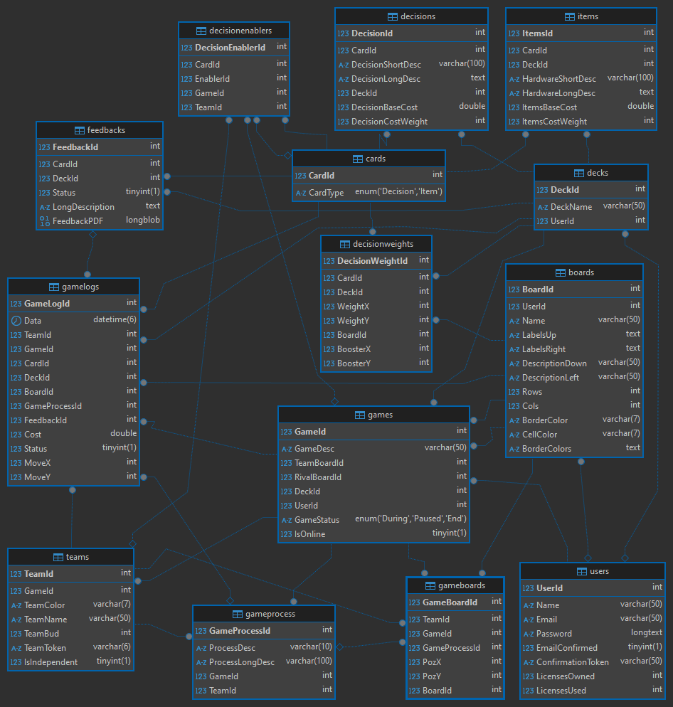

## Konfiguracja MySQL

### Instalacja MySQL Server

[Pobierz](https://dev.mysql.com/downloads/installer/) i zainstaluj MySQL Installer Community

Zainstaluj tylko MySQL Server 
PAMIĘTAJ! Podczas konfigurtacji serwera Hasło roota ustaw na 'root'

## Konfiguracja DOTNET

### Instalacja .NET

[Pobierz](https://dotnet.microsoft.com/en-us/download) i zanistaluj .NET 8.0 

Następnie zainstaluj Microsoft.EntityFrameworkCore używając:
    `dotnet tool install --global dotnet-ef `

Następnie sprawdź czy dotnet-ef został zainstalowany:
    `dotnet tool list -g `

### Tworzenie bazy danych

Stwórz migrację bazy danych:
    `dotnet ef migrations add DatabaseCreatedByNazwaGit `
Następnie stwórz wszystkie tabele poleceniem:
    `dotnet ef database update`

Wszysko powinno teraz działać

### UWAGA !! 

Jeżeli będzie jakiś problem z Bazą Dancyh, użyj polecenia:
    `dotnet ef database drop`
i stwórz ponownie Bazę Danych

## Schemat Bazy Danych

